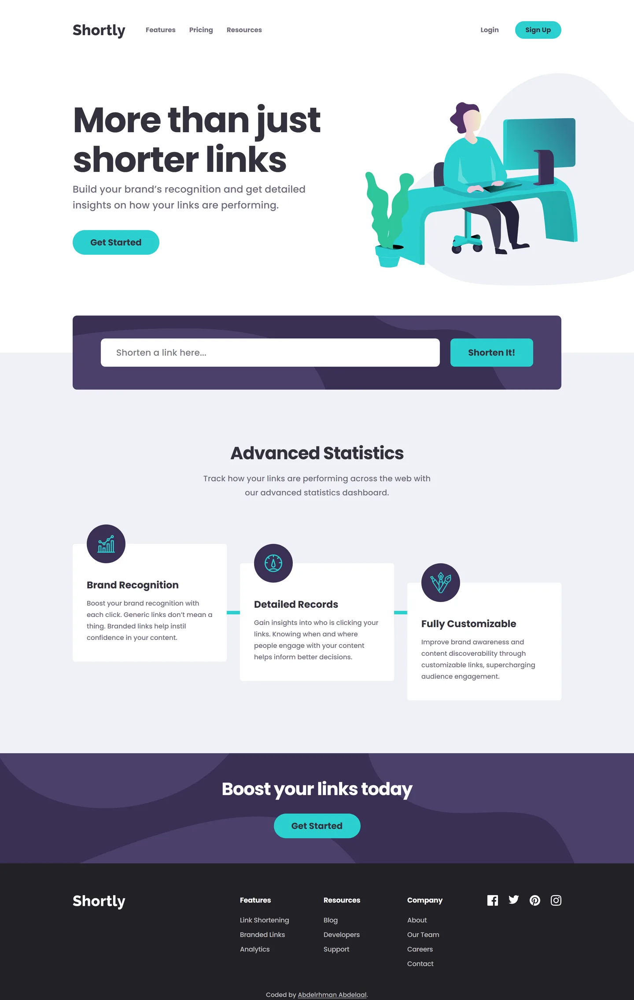

# Frontend Mentor - Shortly URL shortening API landing page solution

This is a solution to the [URL shortening API landing page challenge on Frontend Mentor](https://www.frontendmentor.io/challenges/url-shortening-api-landing-page-2ce3ob-G). Frontend Mentor challenges help you improve your coding skills by building realistic projects.

## Table of contents

- [Overview](#overview)
  - [Screenshot](#screenshot)
  - [Links](#links)
- [My process](#my-process)
  - [Built with](#built-with)
  - [Design deviations](#design-deviations)
  - [Implementation notes](#implementation-notes)
- [Author](#author)

## Overview

### Screenshot

### Links

- Solution URL: [GitHub](https://github.com/MrBlackvanta/url-shortening-api-landing-page)
- Live Site URL: [Netlify](https://vanta-url-shortening-api-landing-page.netlify.app)

## My process

### Built with

- [Next.js 16](https://nextjs.org/) (App Router, React Compiler, Turbopack)
- [React 19](https://react.dev/)
- [TypeScript](https://www.typescriptlang.org/) (strict)
- [Tailwind CSS v4](https://tailwindcss.com/)

### Design deviations

**Contrast, to reach 100 on Lighthouse accessibility.** Six pairings in the supplied design
sit below the WCAG AA threshold. Every ratio below is measured from composited pixels in the
production build, against the backdrop the text actually sits on, and each change is the
smallest one that clears the bar on the _worst_ of those backdrops.

|                                       | design           | contrast                 | shipped                | contrast    |
| ------------------------------------- | ---------------- | ------------------------ | ---------------------- | ----------- |
| Label on every cyan button            | white            | 2.99:1                   | `#34313D`              | 6.68:1      |
| Body copy, nav links, card copy       | `#9E9AA8`        | 2.75 white, 2.43 section | `hsl(257 7.4% 45.4%)`  | 5.14 / 4.55 |
| Shortened link on a white row         | `#2BD0D0`        | 1.90:1                   | `hsl(180 65.7% 31.1%)` | 4.54:1      |
| Error message on the Dark Violet card | `#F46363`        | 3.94 card, 3.06 curve    | `hsl(0 86.8% 78.7%)`   | 5.82 / 4.51 |
| Input placeholder                     | `#34313D` at 50% | 2.86:1                   | `#34313D` at 67%       | 4.54:1      |

Four details worth knowing about those:

- **The cyan surface is kept and the label darkened, not the reverse.** White on the design's
  cyan is 1.90:1, and no cyan that carries a white 15px label at AA is recognisable as the
  brand colour: it has to drop to `hsl(180 65.7% 31.1%)`, eighteen lightness points down.
  Since the pills are large areas and the labels are small, changing the label preserves the
  page's colour far better than changing the surface.
- **The off-white section is what governs the body colour.** At `45.6%` lightness the copy
  passes on white (5.07:1) but fails on the `#EFF1F7` section at **4.49:1**. `45.4%` is the
  first step that clears both. The margin is one hundredth of a ratio point, so the value is
  solved against the rounded 8-bit channels the browser actually paints, not the unrounded
  HSL.
- **The error state drops the design's red placeholder tint.** No red can carry placeholder
  text at AA on white: even fully opaque `#F46363` reaches only 3.06:1, and a red dark enough
  to pass is a harsh pure red that breaks the palette. The error stays signalled three ways
  without it: a 3px red border (3.08:1, which passes as a UI boundary), the red message, and
  `aria-invalid` + `aria-describedby`.
- **Hover states are kept exactly as designed.** White on the design's hover fill `#9AE3E3`
  is 1.45:1. Hover is not audited, and every resting state passes, so matching the design
  there is the better trade.

**Five of the seven style-guide colours are rounded** and land one part in 255 away from the
real paint, so the palette uses the exact values: Cyan is `#2BD0D0` not `#2ACFCF`, Very Dark
Blue `#34313D` not `#35323E`, Grayish Violet `#9E9AA8` not `#9E9AA7`, Dark Violet `#3A3054`,
Red `#F46363`. Only Gray and Very Dark Violet were already exact.

**The design also uses three colours the style guide never lists:** `#4B3F6B` for the
decorative curves, `#EFF1F7` for the page background below the hero, and `#9AE3E3` for the
button hover fill.

### Implementation notes

**Letter-spacing is stored as three em ratios, not per-size pixel values.** Every tracked
size in the design reduces to one of them: `-0.025em` covers the 80px and 42px headlines and
the 40px and 28px section headings (measured -2px, -1.05px, -1px and -0.7px); `0.0068em`
covers the 22px, 18px and 16px body sizes; `-0.0156em` covers both footer sizes. The two
input placeholders are the only outliers at `0.0075em`, folded into the body token because
the difference across the whole placeholder string is 0.3px.

**Both hard line breaks are constrained widths, not ` `.** The headline breaks after
"just" at every size. Its longest line measures **7.038em** and adding the next word jumps to
**10.797em**, an unusually wide band, so a single `8em` cap sits mid-band and holds the break
at 80px and 42px alike. A ` ` would overflow narrow viewports, and a px width would be a
coin flip on sub-pixel font metrics.

**The page background switches colour at the shorten card's vertical centre.** Rather than
hard-coding the 800px offset where that lands, the switch is a half-card-height white band
anchored to the top of the card's own section, so it stays centred on the card no matter how
the content above it reflows.

**Link shortening goes through a Route Handler, not the browser.** `POST /api/shorten` proxies
cleanuri server-side, which sidesteps CORS entirely and keeps the upstream contract in one
place: it normalises a missing scheme, maps upstream 4xx to a friendly message, guards against
a non-JSON response, and aborts after 8 seconds. The page itself still prerenders as static;
only the handler is dynamic.

**Saved links are read through `useSyncExternalStore`.** localStorage is an external store, so
reading it in an effect and calling `setState` would be a cascading render (React Compiler's
lint rule rejects it outright). The server snapshot is a stable empty array, which keeps
hydration honest with no `suppressHydrationWarning`.

**Section reveals are pure CSS, with no JavaScript and no risk of hidden content.** The stats
heading, each feature card, the boost block and the footer fade and rise as they scroll in,
driven by `animation-timeline: view()` rather than an IntersectionObserver, so the three static
sections stay server components and ship no extra bytes. Two guards make it safe: the whole
rule sits inside `prefers-reduced-motion: no-preference` and `@supports (animation-timeline:
view())`, so browsers without view timelines simply render the content. A view timeline is also
inactive while its subject is out of range, which means the fallback everywhere is the element
at full opacity, never a blank box. The range is `entry 0% entry 80%`, deliberately not
`entry 100%`: the footer's entry range finishes about two pixels past the document's maximum
scroll position, so at 100% it would sit at 99% opacity forever.

**The design has no tablet layout, so the 768px band is a judgement call.** Between 768px and
1023px the page uses the mobile structure with the desktop treatment where it fits: the shorten
form and the result rows switch to their single-row layout, the shorten card's decorative
artwork switches to the desktop SVG, the footer's three link columns sit side by side, and the
hero illustration centres instead of bleeding off the right edge. Everything else is the mobile
stack with its measured widths preserved and capped so text does not stretch: the hero copy and
the stats intro at 480px, the feature cards at 448px. Three cards across is not viable there,
since at 768px each would be 215px wide and the body copy would run to eight lines.

**Two places where the design is internally inconsistent, and what I did:**

- The mobile feature cards use a 41px bottom padding on the two four-line cards and 32px on
  the five-line one. Uniform padding is the defensible choice, so the middle card is 9px
  taller than the mock and everything below it on mobile sits 9px lower.
- The footer is 16px taller than the mock on mobile, because it carries the attribution line
  that the mock has no room for.

## Author

- UpWork - [Abdelrhman Abdelaal](https://upwork.com/freelancers/~01f0a9479696b61f49)
- Frontend Mentor - [@MrBlackvanta](https://www.frontendmentor.io/profile/MrBlackvanta)
- LinkedIn - [Abdelrhman Abdelaal](https://www.linkedin.com/in/abdelrhman-vanta/)
